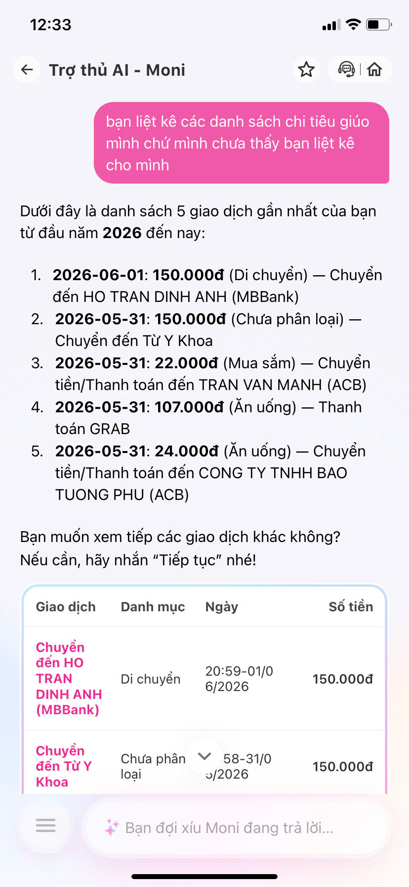
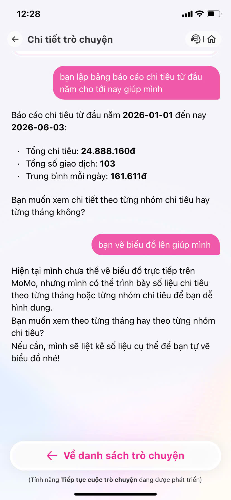
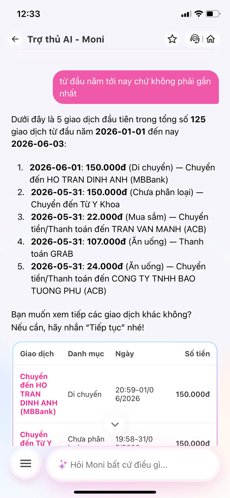
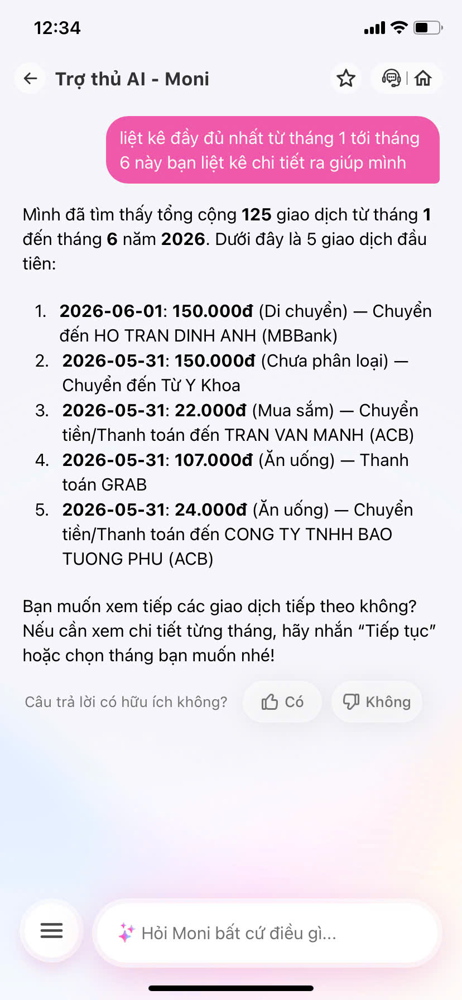
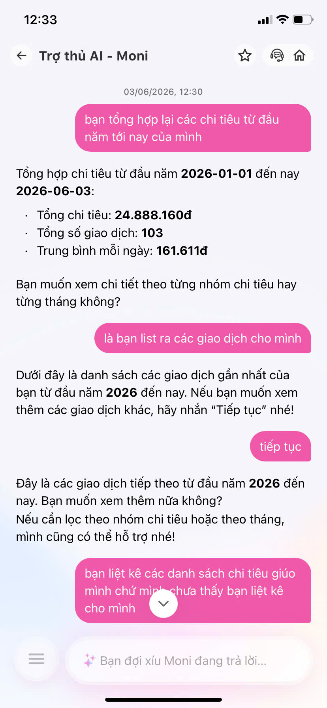
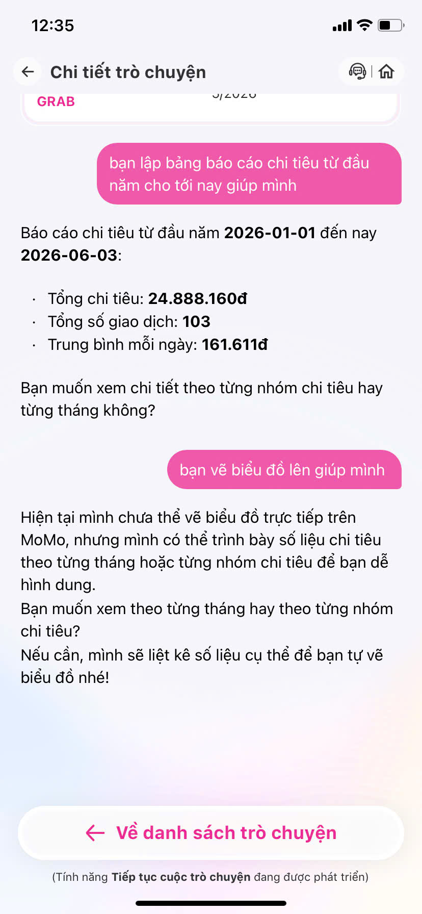

# App Teardown: MoMo — Moni

## 1. Thông tin chung
- **Sản phẩm:** MoMo — Moni (Trợ thủ tài chính, phân tích chi tiêu, chatbot)

## 2. Dùng thử: promise vs reality

Ghi nhanh:
- **Product hứa gì?**: Khát vọng bình dân hoá dịch vụ tài chính
- **User nào được hứa sẽ được giúp?**: Giúp người Việt làm được nhiều hơn với tiền.
- **Bạn kỳ vọng AI làm được task nào?** Vẽ được dashboard phân tích chi tiêu, thêm tính năng tiếp tục đoạn chat trong lịch sử. Nên cho list được các lịch sử gia dịch hoạc chi tiêu.
- **Khi dùng thật, điểm gãy xuất hiện ở đâu?** Khi mà yêu cầu những task vụ cao hơn nhue là vẽ dasboard, hoặc yêu cầu những thứ liên quan đến xử lý dữ liệu có cấu trúc, không có tính linh hoạt cao. 

Evidence cần có:
- Screenshot:

- Quote từ app/web/review: Moni
- Prompt/input đã thử: Vẽ cho tôi 1 cái         
- Hành vi quan sát được:  Không thể vẽ hình

## 3. Vẽ 4 paths

| Path | Câu hỏi cần trả lời | Trải nghiệm thực tế |
|---|---|---|
| **Happy** | Khi AI đúng và tự tin, user thấy gì? | Trả lời nhanh gọn các câu hỏi cơ bản về số dư, liệt kê giao dịch gần nhất dưới dạng text. |
| **Low-confidence** | Khi AI không chắc, hệ thống có hỏi lại, show options hoặc chuyển người không? | AI thường đưa ra câu trả lời chung chung hoặc xin lỗi, chưa có gợi ý fallback thông minh hay show options cụ thể cho các tác vụ phức tạp. |
| **Failure** | Khi AI sai, user biết bằng cách nào và sửa thế nào? | AI thông báo trực tiếp là không thực hiện được (VD: "Không thể vẽ hình"). User bị cụt luồng và phải tự nghĩ cách hỏi khác đơn giản hơn. |
| **Correction** | Khi user sửa, correction có được lưu/log/học lại không hay biến mất? | Biến mất. Bot không có khả năng ghi nhớ context và sửa sai ngay lập tức nếu user dạy lại. |

## 4. Viết finding thành quyết định

**Finding 1:**
- Khi user `[yêu cầu vẽ biểu đồ hoặc tạo dashboard phân tích chi tiêu]`,
- AI/product `[không thể thực hiện được và chỉ trả lời bằng text là không có khả năng]`,
- Hậu quả là `[user bị cụt luồng trải nghiệm, không giải quyết được nhu cầu xem dữ liệu trực quan để quản lý tài chính]`.
- Lỗi thuộc layer `[Intent / Data-tool]`.
- Nên sửa bằng `[Fallback / UX: Thay vì trả lời không làm được, Moni nên bắt được intent "xem thống kê" và hiển thị một Action Button dẫn trực tiếp đến tính năng "Quản lý chi tiêu" có sẵn trong app MoMo]`.

## 5. Sketch as-is / to-be

- **As-is:** 
  - User: "Vẽ cho tôi 1 cái dashboard"
  - AI: Phân tích text -> Phát hiện thiếu tool sinh ảnh -> Báo lỗi.
  - AI trả lời: "Xin lỗi, tôi không thể vẽ hình..." ❌ *(Điểm gãy: Cụt luồng giao tiếp, không giải quyết được vấn đề lõi là muốn xem tình hình tài chính)*
  - User: Thất vọng, phải tự back ra ngoài tìm nút Thống kê.

- **To-be:** 
  - User: "Vẽ cho tôi 1 cái dashboard"
  - AI: Phát hiện từ khóa "dashboard/thống kê" -> Nhận ra không vẽ được -> Fallback sang gọi tính năng Native của app. ✅
  - AI trả lời: "Dạ Moni chưa tự vẽ được biểu đồ theo ý bạn, nhưng MoMo có sẵn Bảng phân tích chi tiêu tháng này rất chi tiết nè!"
  - UI hiển thị thêm: Nút bấm **[Xem Phân Tích Chi Tiêu]** (Deep link sang Mini App Quản lý chi tiêu).
  - User: Bấm vào nút và xem được biểu đồ mình cần.

## 6. Tự kiểm trước khi nộp
- [x] Có ít nhất 1 screenshot hoặc observation cụ thể.
- [x] Có đủ 4 paths hoặc nói rõ path nào chưa có trong product.
- [x] Finding được viết thành product decision, không chỉ là nhận xét.
- [x] Sketch có as-is và to-be.
- [x] Có một câu nói rõ finding này sẽ đổi gì trong SPEC.
  - **Thay đổi trong SPEC:** Cập nhật logic xử lý cho Intent "Yêu cầu hình ảnh/báo cáo tổng hợp": Nếu bot không thể sinh hình ảnh, bắt buộc phải trả về Deep Link hướng dẫn user đến tính năng Quản lý chi tiêu Native thay vì text từ chối đơn thuần.
